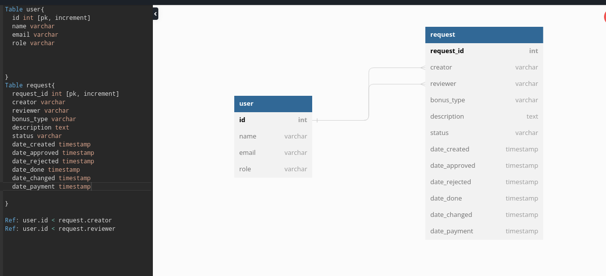

# Lannister

## API

### Fetch information about all users.

This method shows all registered users.

**GET <base_url>/users/**

Return:

    200: content found
    400: bad request
    401: unauthorized 
    403: forbidden
    500: internal server error  

### Fetch information about reviewers.

This method shows all reviewers.

**GET <base_url>/reviewers/**

Return:

    200: Content found
    400: bad request
    404: file not found 
    500: internal server error 

### Fetch information about requests

This method shows all requests.

**GET <base_url>/requests/**

Return:

    200: Content found
    400: bad request
    404: file not found 
    500: internal server error 

### Fetch information about request

This method shows single request.

**GET <base_url>/requests/<request_id>**

Return:

    200: сontent found
    400: bad request
    404: file not found 
    500: internal server error  

### User registration

**POST <base_url>/registration**

The payload MUST contain the following json properties:

 *name*: username,

 *email*: your work email,

 *password*: your account password,

Return:

    201: created
    400: bad request

### Generate a request

Worker create new request with info: bonus-type,description, and she/he choose reviewer.

**POST <base_url>/request**

The payload MUST contain the following json properties:

 *creator*: Worker who create the request,

 *reviewer*: A person who is assigned to review the request,

 *bonus_type*: It can be a referral bonus, overtime, etc,

*description*: information about the bonus,

Return:

    201: created
    404: content not found
    401: unauthorized 

### Add role

The admin can choose single user to add Reviewr role.

**POST <base_url>/user/<user_id>/<user_role>**

The payload MUST contain the following json properties:

*name*: the username

*email*: the user email

*roles*: role in the company

Return:

     201: created
     400: bad request
     403: forbidden

### Edit the selected request

The worker can change the selected request.

**PUT <base_url>/request/<request_id>**

Payload: it is a json payload structured like:

{    
    "creator" : "< value >",  
    "reviewer": "< value >",  
    "bonus_type": "< value >",  
    "description": "< value >",  
    "status": "< value >"  
}

Return:

    200: content found (OK: file updated and db updated )
    201: the content was added (created)
    400: bad request (File not saved) 
    401: unauthorized 
    404: not found (File not found) 
    500: internal server error (File was copied, but database was not updated)

### Remove role
The admin can choose single user to remove Reviewer role.

**DELETE <base_url>/user/<user_id>/<user_role>**

Return:

    200: content found 
    204: no content 
    400: bad request
    403: forbidden
    404: not found (File not found) 

### Remove request
The user can delete the selected request

**DELETE <base_url>/request/<request_id>**

Return:

    200: content found
    204: no content
    400: bad request
    403: forbidden
    404: not found (File not found) 

## Database

### Tables

    
<b>user</b>

        Keeps information about user.
        <table>
            <tr>
                <th>Field</th>
                <th>Data type</th>
                <th>Description</th>
            </tr>
            <tr>
                <td><b>id</b></td>
                <td>character(12)</td>
                <td>User ID (Slack Member ID). A unique primary key.</td>
            </tr>
            <tr>
                <td><b>name</b></td>
                <td>character(80)</td>
                <td>Username.</td>
            </tr>
            <tr>
                <td><b>email</b></td>
                <td>character(40)</td>
                <td>User email.</td>
            </tr>
            <tr>
                <td><b>roles</b></td>
                <td>user_role[]</td>
                <td>List of user roles. Contains one or more roles from <i><a href="#user_role">user_role</a></i> enumerable type.</td>
            </tr>
    </table>
<h4>Constraints:</h4>
    <ul>
        <li>A single user cannot have more than 3 roles since there are only 3 options in <i><a href="#user_role">user_role</a></i> enumerable type.</li>
    </ul>

    
<b>request</b>

    Keeps information about a request.
    <table>
        <tr>
            <th>Field</th>
            <th>Data Type</th>
            <th>Nullable</th>
            <th>References</th>
            <th>Description</th>
        </tr>
        <tr>
            <td><b>id</b></td>
            <td>int</td>
            <td></td>
            <td></td>
            <td>Serial primary key of a request. Used to uniquely identify each request.</td>
        </tr>
        <tr>
            <td><b>creator</b></td>
            <td>character(12)</td>
            <td></td>
            <td><a href="#users">users</a>.id</td>
            <td>The request creator.</td>
        </tr>
        <tr>
            <td><b>reviewer</b></td>
            <td>character(12)</td>
            <td></td>
            <td><a href="#users">users</a>.id</td>
            <td>The request reviewer.</td>
        </tr>
        <tr>
            <td><b>bonus_type</b></td>
            <td>character(40)</td>
            <td></td>
            <td></td>
            <td>A type of bonus requested by user(overtime, referral bonus, etc.)</td>
        </tr>
        <tr>
            <td><b>description</b></td>
            <td>text</td>
            <td>null</td>
            <td></td>
            <td>An additional information about the request written by user.</td>
        </tr>
        <tr>
            <td><b>status</b></td>
            <td>request_status</td>
            <td></td>
            <td></td>
            <td>The request status. Contains one of the options from <i><a href="#request_status">request_status</a></i> enumerable type. Since primary key references an existing request, status field has a <i>'created'</i> value by default.</td>
        </tr>
        <tr>
            <td><b>date_created</b></td>
            <td>timestamp</td>
            <td></td>
            <td></td>
            <td>Full request creation date. Completes automatically when the request is created.</td>
        </tr>
        <tr>
            <td><b>date_approved</b></td>
            <td>timestamp</td>
            <td>null</td>
            <td></td>
            <td>Full request approval date. Filled when the request gains an <i>'approved'</i> status.</td>
        </tr>
        <tr>
            <td><b>date_rejected</b></td>
            <td>timestamp</td>
            <td>null</td>
            <td></td>
            <td>Full request rejection date. Filled when the request gains a <i>'rejected'</i> status.</td>
        </tr>
        <tr>
            <td><b>date_done</b></td>
            <td>timestamp</td>
            <td>null</td>
            <td></td>
            <td>Contains a full date of the bonus request fulfilment.</td>
        </tr>
        <tr>
            <td><b>date_changed</b></td>
            <td>timestamp</td>
            <td>null</td>
            <td></td>
            <td>Full date of the request last change. <b>Notice</b>: this date updates due to a change of the request data from <i><a href="#request">request</a></i> table.</td>
        </tr>
        <tr>
            <td><b>date_payment</b></td>
            <td>timestamp</td>
            <td>null</td>
            <td></td>
            <td>Full date of the payday. Filled when the request gains an <i>'approved'</i> status and has a payday arranged.</td>
        </tr>
    </table>
    <h4>Constraints:</h4>
        <ul>
            <li>A request cannot be approved and rejected at the same time.</li>
            <li>Reviewer must have 'reviewer' role in his <i><a href="#users">users</a>.roles</i> list.</li>
            <li>Creator and reviewer columns cannot reference the same <i><a href="#users">users</a>.id</i>.
        </ul>

### Enumerable types

    
<b>user_role</b>

    <table style="float: none;">
        <tr><th>Role</th></tr>
        <tr><td>worker</td></tr>
        <tr><td>reviewer</td></tr>
        <tr><td>admin</td></tr>
    </table>

    
<b>request_status</b>

    <table>
        <tr><th>Status</th></tr>
        <tr><td>created</td></tr>
        <tr><td>approved</td></tr>
        <tr><td>rejected</td></tr>
        <tr><td>done</td></tr>
    </table>

### Database diagram

Or link of database
https://dbdiagram.io/embed/637377a5c9abfc611172c766